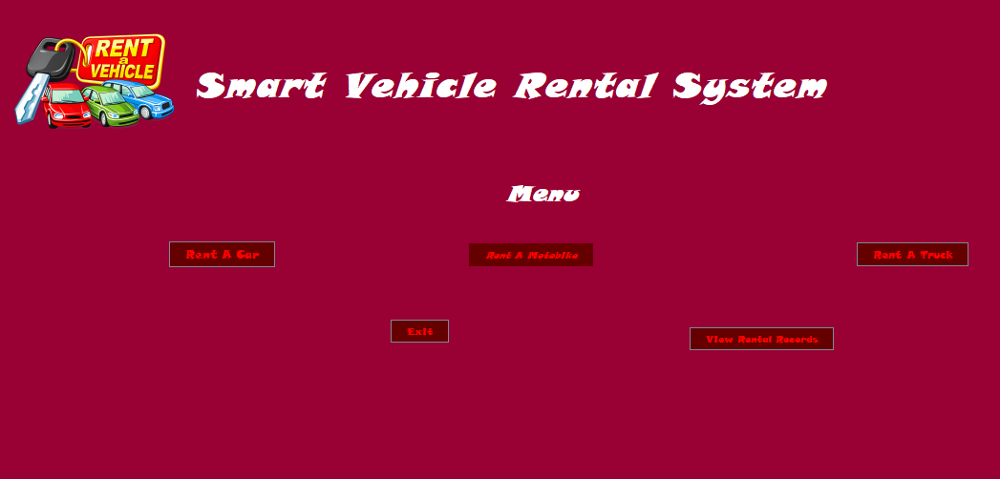
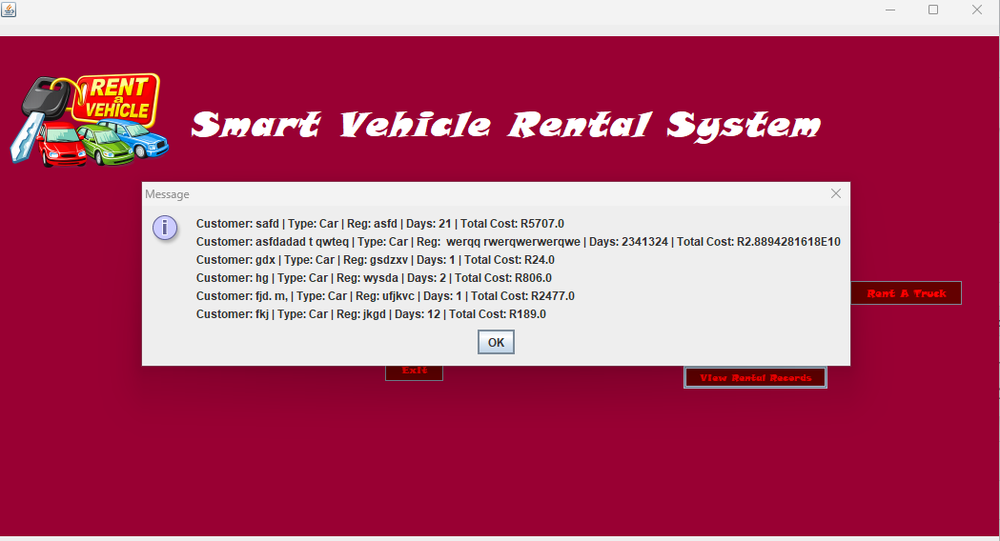

# RentVehicle
# About The Project
I made RentVehicle as a school project to learn about software development and object-oriented programming.
It is, about a system to rent vehicles.This system helps users to manage and interact with vehicle information easily.
I am sharing this project to show how I have learned and grown as a computer science student.I want to demonstrate my coding skills.
The project shows my journey of learning.

# Screenshots

## Menu

## Records 

# Contribute
Feel free to contribute or fork to the project while following the GPL version 3.0 License terms and condition.
